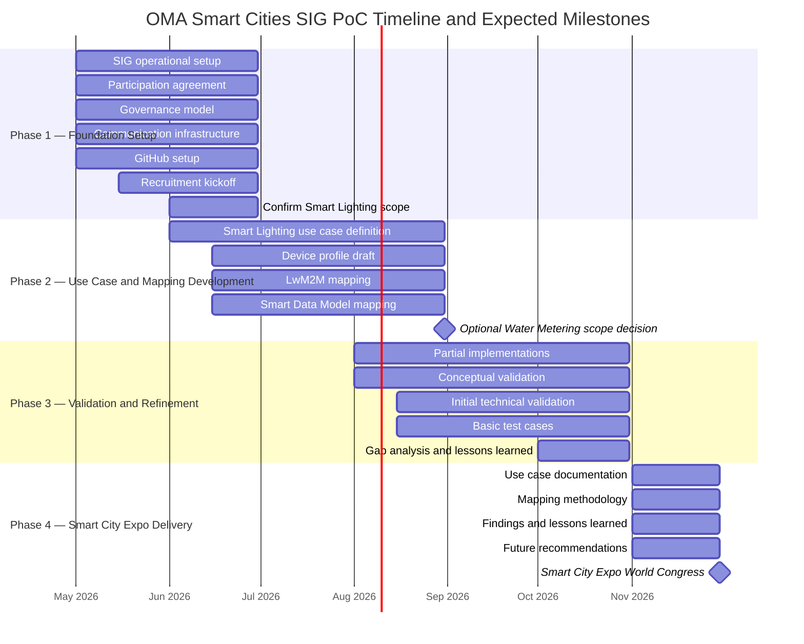

# Release Planning

This document defines the high-level execution roadmap, milestones, and expected deliverables for the OMA Smart Cities SIG PoC initiative between May 2026 and November 2026.

The purpose of this plan is to provide participants, contributors, and future stakeholders with a clear understanding of:
- the planned phases of execution,
- major objectives and deliverables,
- expected validation milestones,
- and the timeline leading to the Smart City Expo World Congress 2026 showcase.

The roadmap is intentionally lightweight and iterative, reflecting the Proof of Concept nature of the initiative while maintaining focus on interoperability, reusable outputs, and ecosystem collaboration.

### Phase Summary and Key Milestones

<table>
  <caption><strong>Phase Summary and Key Milestones</strong></caption>
  <thead>
    <tr>
      <th>Phase</th>
      <th>Timeline</th>
      <th>Main Objective</th>
    </tr>
  </thead>
  <tbody>
    <tr>
      <td>Phase 1 — Foundation Setup</td>
      <td>May–June 2026</td>
      <td>Establish governance, tooling, participation model, and initial scope</td>
    </tr>
    <tr>
      <td>Phase 2 — Use Case and Mapping Development</td>
      <td>June–August 2026</td>
      <td>Develop Smart Lighting use cases, mappings, and device profile structure</td>
    </tr>
    <tr>
      <td>Phase 3 — Validation and Refinement</td>
      <td>August–October 2026</td>
      <td>Validate mappings and refine outputs through lightweight implementations and testing</td>
    </tr>
    <tr>
      <td>Phase 4 — Smart City Expo Delivery</td>
      <td>November 2026</td>
      <td>Present findings, outputs, and recommendations at Smart City Expo World Congress</td>
    </tr>
  </tbody>
</table>
