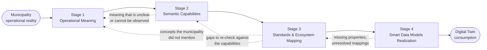
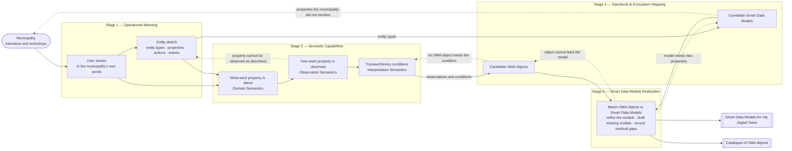

# {{ $doc.title }}

## Introduction

Municipalities are increasingly investing in Digital Twin initiatives to improve the operation, monitoring, optimization, and long-term management of public services such as public lighting, water irrigation, environmental monitoring, transportation, and energy management.

However, municipalities often face significant interoperability challenges:
- operational information is fragmented across systems and vendors,
- measurements are interpreted differently,
- contextual information is lost,
- semantic meaning is inconsistent,
- and Digital Twins consume data that may not be sufficiently reliable, contextualized, or comparable.

The Smart Cities SIG was created to help address this challenge.

The SIG provides a collaborative space where municipalities, standards organizations, ecosystem initiatives, universities, vendors, and interoperability experts can jointly analyze municipality operational realities and progressively transform them into semantically reliable interoperability outputs suitable for Digital Twin consumption.

The SIG does not replace existing standards organizations, Smart Data Models ecosystems, or Digital Twin platforms.

Instead, the SIG acts as:
- an operational semantic translation initiative,
- an interoperability coordination space,
- and a collaborative ecosystem alignment mechanism.

---

# Why Raw Telemetry Is Not Enough

Raw telemetry alone is insufficient to create a trustworthy and operationally useful Digital Twin.

Digital Twins require more than raw telemetry, disconnected measurements, or isolated device outputs. They require:
- contextual information,
- semantic consistency,
- provenance awareness,
- interoperability reliability,
- and operational meaning preservation.

The methodology therefore treats interoperability and semantic integrity as foundational requirements for trustworthy Digital Twin integration. The specific dimensions of meaning a Digital Twin needs are defined as the [semantic capabilities](/methodology/core-methodology/stage-2-semantic-capabilities.md).

---

# Purpose of the Methodology

The purpose of this methodology is to provide a practical and repeatable approach for transforming municipality operational realities into reusable interoperability understanding.

The methodology focuses on:
- preserving operational meaning,
- identifying semantic distinctions,
- deriving reusable semantic capabilities,
- and coordinating ecosystem realization approaches.

---

# Meaning Before Standards

The methodology's central principle is that **operational meaning is captured before any standard, schema, or architecture is chosen**.

The methodology prioritizes:
1. understanding the municipality operational intent,
2. identifying reusable semantic capabilities,
3. and only then evaluating how ecosystem participants may contribute standards, semantic models, Smart Data Models, validation approaches, and Digital Twin integration mechanisms.

If analysis begins too early with standards, schemas, APIs, or implementation models, important operational meaning may be lost. Each stage applies the principle in its own way:

| Stage | What the principle rules out |
|---|---|
| Stage 1 | Mapping municipality concepts into existing standards, designing schemas, or discussing architecture before the operational intent is understood |
| Stage 2 | Turning semantic capabilities directly into standards objects, which limits interoperability flexibility |
| Stage 3 | Selecting a single implementation approach or platform too early, or formalizing every observation as a standard |
| Stage 4 | Starting from model structure rather than from the assessed semantic capabilities, or converging around a single ecosystem's assets |

---

# Core Methodology

The Smart Cities SIG methodology is based on four stages. The work runs through them in order, but not in one direction only: a later stage often finds something an earlier stage missed, and the work goes back to that stage before it continues.

*Solid arrows show the main flow; dotted arrows show findings sent back to an earlier stage.*

A loop back sends a question, not an answer. When Stage 3 finds a concept the municipality did not mention, Stage 1 asks the municipality whether it matters; the standard does not decide for it (see [Meaning Before Standards](#meaning-before-standards)). What still cannot be resolved is recorded as a [residual gap](/methodology/core-methodology/stage-4-smart-data-models-realization.md#identifying-residual-gaps) in Stage 4.

| Stage | Question it answers | Output |
|---|---|---|
| [Stage 1 — Operational Meaning](/methodology/core-methodology/stage-1-operational-meaning.md) | What is the municipality actually trying to achieve? | User stories, an entity sketch, operational objectives, pain points, semantic distinctions, contextual dependencies |
| [Stage 2 — Semantic Capabilities](/methodology/core-methodology/stage-2-semantic-capabilities.md) | Which reusable dimensions of meaning does a Digital Twin need? | The taxonomy of 14 semantic capabilities, and the entity sketch's properties classified against it |
| [Stage 3 — Standards & Ecosystem Mapping](/methodology/core-methodology/stage-3-standards-mapping.md) | Which ecosystems can supply each capability, and where are the gaps? | Ecosystem assessment reports, produced with the [Semantic Capability Assessment Framework](/methodology/assessment-frameworks/semantic-capability-assessment.md) |
| [Stage 4 — Smart Data Models Realization](/methodology/core-methodology/stage-4-smart-data-models-realization.md) | How do the ecosystem contributions come together into Smart Data Models a Digital Twin can consume? | Converged Smart Data Model realization, a catalogue of the OMA objects that can feed it, and the residual gaps |

Supporting material:
- The [Methodology Worksheet](/methodology/core-methodology/methodology-worksheet.md) is the practical template for analysing a Service Domain in Stages 1 and 2.
- Each Service Profile under `profiles/` holds the walkthrough and municipality operational questions for one Service Domain.

## How the Work Flows

The diagram below shows the main activities inside each stage, and the findings that send the work back to an earlier stage or to the municipality.

*Solid arrows show the main flow; dotted arrows show findings sent back.*

The search for candidate Smart Data Models needs only the entity types from Stage 1, so it can start before Stage 2 is complete. The search for OMA objects needs the observations and trustworthiness conditions from Stage 2.

| Finding | Found in | Goes back to |
|---|---|---|
| A property cannot be observed as the municipality described it | Stage 2 | Stage 1, as a question for the municipality |
| A Smart Data Model defines properties the municipality did not mention | Stage 3 | Stage 1, as a question for the municipality |
| No OMA object meets a trustworthiness condition | Stage 3 | Stage 2, to re-check the condition before recording a gap |
| A Smart Data Model needs new properties | Stage 4 | Stage 3, to look for a model that has them or to record a gap |
| An OMA object cannot feed the model | Stage 4 | Stage 3, to look for another object or to record a gap |

When no Smart Data Model fits an entity type, Stage 3 records it, and Stage 4 drafts a new model from the entity sketch.

## Operational Semantic Translation Model

The model illustrates how municipality operational realities are progressively transformed into reusable interoperability understanding, ecosystem realization approaches, and semantically reliable Digital Twin consumption.

*Figure — Smart Cities SIG Operational Semantic Translation Model*
