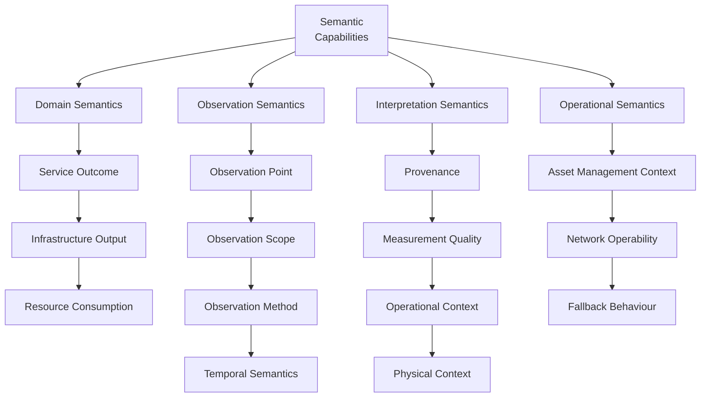

# {{ $doc.title }}

## Introduction

Stage 2 generalizes the operational meaning captured in [Stage 1](/methodology/core-methodology/stage-1-operational-meaning.md) into **semantic capabilities**: reusable dimensions of meaning that a Digital Twin needs in order to interpret municipality operational data correctly, and applies them to each property of the Stage 1 entity sketch.

This page is the authoritative definition of every semantic capability. Other documents — the [Semantic Capability Assessment Framework](/methodology/assessment-frameworks/semantic-capability-assessment.md), the ecosystem assessment reports, and the Service Profiles — link here rather than restating the definitions.

For the methodology as a whole, including why operational meaning is captured before any standard is considered, see the [Methodology Overview](/methodology/core-methodology/methodology-overview.md).

**Input:** the user stories, entity sketch, operational objectives, pain points, semantic distinctions, and contextual dependencies from Stage 1.
**Output:** for each Service Domain, the properties of the Stage 1 entity sketch, each classified against the taxonomy of 14 semantic capabilities in 4 semantic categories below. [Stage 3](/methodology/core-methodology/stage-3-standards-mapping.md) uses them to find candidate OMA objects and to assess standards ecosystems; [Stage 4](/methodology/core-methodology/stage-4-smart-data-models-realization.md) uses them to check that those objects can feed the Smart Data Models.

---

# Purpose of Stage 2

Stage 2 exists to answer the following questions:

- What is each property in the entity sketch about: the service outcome, the output of the infrastructure, or the resources consumed?
- Whether, where, and how can each property be observed?
- Under which trustworthiness conditions can each observation be relied on?
- What contextual information must always remain attached to the data?
- Which distinctions recur across Service Domains such as public lighting, water management, or waste management?

The capabilities are the same for every Service Domain. Stage 2 applies them to each new domain, and adds a capability only when an existing one cannot hold the meaning (see [Artificial Generalization](#artificial-generalization)).

---

# What is a Semantic Capability?

A raw value says little on its own. A **semantic capability** captures one dimension of meaning needed to interpret operational data correctly: what it represents, where it comes from, how much it can be trusted, or how it should be acted on.

Semantic capabilities:
- emerge from operational analysis rather than from any standard,
- preserve operational meaning,
- and apply across multiple Service Domains — only the municipality operational questions change from one service to another.

They are not yet standards objects, schemas, APIs, or implementation models. How each ecosystem represents a capability is assessed in Stage 3.

---

# How Capabilities Emerge

This section describes how the taxonomy was built and how it grows. Semantic capabilities emerge progressively during operational analysis. The process usually involves:
1. identifying operational distinctions,
2. recognizing repeated semantic patterns,
3. separating operational meaning from local implementation details,
4. and progressively generalizing reusable concepts.

This process should remain iterative, practical, and operationally grounded. The objective is not to create a theoretical semantic framework, but to preserve interoperability-relevant operational meaning.

---

# Classifying Observations

Stage 1 material is classified against the capabilities using the following terms:

- An **observation** is the raw, possibly compound fact as originally stated: a property in the entity sketch, or a statement in municipality or ecosystem material.
- A **sub-observation** is what results from splitting an observation so that each piece is fundamentally about exactly one capability.
- That capability is the sub-observation's **Primary Capability**. A sub-observation may also carry **Companion Capabilities** that provide context.

Each capability below includes a *How to classify* rule, including tie-breakers against neighbouring capabilities.

When Stage 1 provides an [entity sketch](/methodology/core-methodology/stage-1-operational-meaning.md#entity-sketch), each property of each entity is examined in turn:
1. what the property is about — the [Domain Semantics](#domain-semantics) capabilities: the service outcome the municipality cares about, the output of the infrastructure, or the resources it consumes,
2. whether, where, and how it can be observed — the [Observation Semantics](#observation-semantics) capabilities,
3. and under which trustworthiness conditions the observation can be relied on — the [Interpretation Semantics](#interpretation-semantics) capabilities.

[Operational Semantics](#operational-semantics) describe how the infrastructure is operated and managed. How they apply to the entity sketch, for example to the entities themselves or to their actions and events, is still under discussion by the SIG.

A property that cannot be observed as the municipality described it goes back to Stage 1 as a question for the municipality.

---

# Semantic Categories

The capabilities are organized into four **semantic categories**, following the viewpoint-and-view structure defined in Clause 6 of ISO/IEC 30141:2024.

| Semantic Category | Describes | Primary ISO/IEC 30141 viewpoints | Capabilities |
|---|---|---|---|
| [Domain Semantics](#domain-semantics) | **What the municipality ultimately cares about**: the service delivered, the infrastructure providing it, and the resources consumed | Business, Usage | Service Outcome, Infrastructure Output, Resource Consumption |
| [Observation Semantics](#observation-semantics) | **How operational information is observed**: where it originates, what it represents, how it is obtained, and its time basis | Foundational IoT, Functional | Observation Point, Observation Scope, Observation Method, Temporal Semantics |
| [Interpretation Semantics](#interpretation-semantics) | **How observations should be understood and trusted**: provenance, quality, and context | Trustworthiness | Provenance, Measurement Quality, Operational Context, Physical Context |
| [Operational Semantics](#operational-semantics) | **How infrastructure is operated and managed** throughout its lifecycle: responsibility, communications, and resilience | Functional, Construction | Asset Management Context, Network Operability, Fallback Behaviour |

"Domain Semantics" is the name of a category; it does not refer to a Service Domain.

---

# Domain Semantics

Domain Semantics describe **what municipalities ultimately care about**. They distinguish the operational service being delivered from the behaviour of the infrastructure providing that service and from the resources it consumes. In Stage 1, the benefit a user story ends with usually names the Service Outcome, and each property in the entity sketch is classified as one of the three capabilities below.

Aligned primarily with the Business and Usage viewpoints of ISO/IEC 30141, which describe intended service outcomes, stakeholder needs, and the interaction between IoT systems and the physical entities supporting municipal services.

## Service Outcome

**Definition.** The actual outcome experienced by people, infrastructure, or the environment — **what the municipality is trying to achieve**, independently of how the underlying infrastructure operates.

**Why it is required.** Digital Twins must determine whether municipality objectives are being achieved, and infrastructure telemetry alone cannot determine service success. The distinction between infrastructure output and service outcome is therefore fundamental for trustworthy interoperability.

**How to classify.** Use when the sub-observation describes an effect experienced by people, infrastructure, or the environment — the "so what", not the infrastructure's own behaviour or what it cost to produce.

**Examples.** Street illuminance measured at road-surface level; soil moisture available at root level; water pressure delivered to consumers.

**ISO/IEC 30141.** Governed by the Foundational IoT (6.2), Business (6.3), Usage (6.4), Functional (6.5), and Trustworthiness (6.6) viewpoints. Model kind: municipality service semantics – domain outcome model.

## Infrastructure Output

**Definition.** The physical output produced by infrastructure assets while delivering a municipality service — **how the infrastructure behaves**, not whether the municipality objective has been achieved.

**Why it is required.** Service outcomes and infrastructure output are different operational concepts. Keeping them apart lets Digital Twins diagnose operational issues, optimize infrastructure performance, and avoid interpreting infrastructure telemetry as evidence of successful service delivery.

**How to classify.** Use when the sub-observation is about what the infrastructure itself is doing or producing — not whether that produced the intended real-world effect.

**Examples.** Lumens emitted by a luminaire; pump flow rate; valve opening percentage; motor speed.

**ISO/IEC 30141.** Governed by the Foundational IoT (6.2), Functional (6.5), Trustworthiness (6.6), and Construction (6.7) viewpoints. Model kind: municipality service semantics – infrastructure behaviour model.

## Resource Consumption

**Definition.** The resources consumed while delivering the municipality service.

**Why it is required.** Operational efficiency requires separating service quality from resource consumption. A municipality needs to know not only whether the service outcome was achieved, but also what it cost in resources to achieve it.

**How to classify.** Use when the sub-observation is about resources spent (energy, water, fuel, battery) rather than the outcome achieved or the infrastructure's output.

**Examples.** Energy; water; fuel; battery usage; active power; reactive power; voltage; frequency.

**ISO/IEC 30141.** Governed by the Business (6.3), Functional (6.5), Trustworthiness (6.6), and Construction (6.7) viewpoints. Model kind: municipality service semantics – resource efficiency model.

---

# Observation Semantics

Observation Semantics describe **how observations are obtained and compared**. Operational decisions require knowing where an observation was made, what portion of the system it represents, how it was obtained, and over what period it applies. Without these capabilities, observations that appear identical may represent fundamentally different operational realities.

Aligned primarily with the Foundational IoT and Functional viewpoints of ISO/IEC 30141, which treat sensing, connectivity, data handling, and the abstract functions of IoT systems as core architectural concerns.

## Observation Point

**Definition.** The physical or logical location where an observation originates — **where the information was obtained**, independently of the asset being monitored.

**Why it is required.** Measurements taken at different observation points often carry different operational meanings. A Digital Twin must know where an observation was collected before comparing it with other observations or using it for simulation.

**How to classify.** Use when the sub-observation is about where the observation's referent physically or logically sits — a position, not an actor. When the same device name could also answer "who reported it", classify here as primary with Provenance as a companion, unless the sub-observation specifically contrasts sources.

**Examples.** Luminaire; cabinet; line head; street surface; pump; valve; pipeline; root zone; weather station.

**ISO/IEC 30141.** Governed by the Foundational IoT (6.2), Usage (6.4), Functional (6.5), and Trustworthiness (6.6) viewpoints. Model kind: observation semantics – location-of-observation model.

## Observation Scope

**Definition.** The assets, operational area, or population that an observation represents — **what the observation applies to**, rather than where it was collected.

**Why it is required.** Measurements covering different scopes should not be compared without understanding their coverage. Digital Twins require explicit scope to perform meaningful analytics and simulation.

**How to classify.** Use when the sub-observation is about what portion or coverage a value represents, including a value that combines multiple assets or locations into one number. Aggregation across space or assets belongs here; aggregation across time belongs to Temporal Semantics.

**Examples.** Single asset; group of assets; cabinet; street; irrigation zone; district; entire municipality.

**ISO/IEC 30141.** Governed by the Foundational IoT (6.2), Business (6.3), Usage (6.4), Functional (6.5), and Trustworthiness (6.6) viewpoints. Model kind: observation semantics – coverage-of-observation model.

## Observation Method

**Definition.** The method used to produce an observation.

**Why it is required.** Operational trust depends on knowing how information was produced; different methods imply different levels of confidence and different operational uses.

**How to classify.** Use when the sub-observation is about the technique that produced the value — sensing versus a computed or derived process. Never primary for an aggregation-over-time question (that is Temporal Semantics); apply as a companion when the computation itself is worth recording.

**Examples.** Measured; estimated; inferred; predicted; aggregated across assets or locations; simulated; model-derived; proxy measurement.

**ISO/IEC 30141.** Governed by the Functional (6.5) and Trustworthiness (6.6) viewpoints. Model kind: observation semantics – method-of-production model.

## Temporal Semantics

**Definition.** The time basis of an observation and its use in KPIs and simulation.

**Why it is required.** Operational interpretation depends heavily on time. Observations with different time bases should not be compared without understanding them.

**How to classify.** Use when the sub-observation is about the time span a value represents, including a value that combines multiple readings over time into one number (for example, a rolling average) even though it was also computed rather than directly sensed.

**Examples.** Instantaneous; observation interval; sampling period; aggregation window; historical observation; forecast; prediction horizon.

**ISO/IEC 30141.** Governed by the Business (6.3), Functional (6.5), and Trustworthiness (6.6) viewpoints. Model kind: observation semantics – time-basis model.

---

# Interpretation Semantics

Interpretation Semantics describe the **trustworthiness conditions** of an observation — the additional information required to **understand, compare, and trust observations**: where the information originated, how trustworthy it is, under which operating conditions it was obtained, and which physical conditions influenced the result. They let Digital Twins interpret observations consistently across municipalities, vendors, and ecosystems.

Aligned primarily with the Trustworthiness viewpoint of ISO/IEC 30141, which covers the context, provenance, quality, and descriptive information needed to interpret observations consistently across heterogeneous IoT systems.

## Provenance

**Definition.** The origin of an observation or piece of operational information.

**Why it is required.** Operational decisions depend on knowing where information originated. Observations with different provenance may carry different levels of trust, authority, and operational applicability.

**How to classify.** Use when the sub-observation is about which system or actor reported or supplied the information — a source identity, not a location. Classify here as primary (not Observation Point) when the sub-observation specifically contrasts sources, such as device-reported versus manually entered versus externally supplied.

**Examples.** Device sensor; control cabinet; weather service; GIS platform; installation records; asset management system; human operator; Digital Twin; predictive model.

**ISO/IEC 30141.** Governed by the Functional (6.5) and Trustworthiness (6.6) viewpoints. Model kind: interpretation semantics – source-of-information model.

## Measurement Quality

**Definition.** The quality characteristics of an observation: its accuracy, precision, reliability, completeness, and uncertainty.

**Why it is required.** Digital Twins require information about observation quality to support reliable monitoring, analytics, simulation, and operational decision-making.

**How to classify.** Use when the sub-observation is about how reliable or accurate a value is. This is trust conditioned on reliability and accuracy, as distinct from Observation Method, which is trust conditioned on production technique.

**Examples.** Accuracy; precision; confidence; completeness; consistency; availability; resolution; uncertainty.

**ISO/IEC 30141.** Governed by the Trustworthiness (6.6) and Functional (6.5) viewpoints. Model kind: interpretation semantics – quality-of-observation model.

## Operational Context

**Definition.** Dynamic operating conditions that influence service behaviour and the interpretation of observations.

**Why it is required.** The same infrastructure output may produce different service outcomes under different operating conditions. Operational context lets Digital Twins interpret those differences correctly.

**How to classify.** Use when the sub-observation is about a dynamic, situational condition that modulates behaviour in the moment. The boundary with Physical Context is dynamic versus static: weather changes from moment to moment.

**Examples.** Weather; rainfall; humidity; temperature; wind; traffic; occupancy; seasonal conditions.

**ISO/IEC 30141.** Governed by the Business (6.3), Usage (6.4), Functional (6.5), and Trustworthiness (6.6) viewpoints. Model kind: interpretation semantics – operational-conditions model.

## Physical Context

**Definition.** Static physical characteristics of the environment that influence service outcomes.

**Why it is required.** Physical context explains why identical infrastructure output may produce different outcomes. Without it, observations may be interpreted incorrectly.

**How to classify.** Use when the sub-observation is about a static, structural feature of the place. The boundary with Operational Context is dynamic versus static: a tree casting a shadow is a fixed property of the location.

**Examples.** Buildings; trees; vegetation; terrain; slopes; orientation; inclination; shadows; surface materials.

**ISO/IEC 30141.** Governed by the Foundational IoT (6.2), Usage (6.4), Functional (6.5), and Trustworthiness (6.6) viewpoints. Model kind: interpretation semantics – physical-environment model.

---

# Operational Semantics

Operational Semantics describe the information required to **operate, maintain, and control infrastructure** safely, reliably, and efficiently throughout its lifecycle. While the other categories explain what is observed and how to interpret it, these capabilities support operational planning, maintenance, resilience, remote operation, and lifecycle management. Whether, and how, these capabilities apply to the entity sketch is under discussion by the SIG.

Aligned primarily with the Functional and Construction viewpoints of ISO/IEC 30141, which describe how IoT capabilities are organized, implemented, and operated to support real-world municipal services.

## Asset Management Context

**Definition.** Operational management information associated with infrastructure assets throughout their lifecycle.

**Why it is required.** Municipal infrastructure is managed over its whole lifecycle. Digital Twins require this information to support maintenance planning, asset optimization, lifecycle analysis, and accountability.

**How to classify.** Use when the sub-observation is about ownership, lifecycle, or maintenance administration — not about a specific measurement at all.

**Examples.** Ownership; responsible organization; operational zone; maintenance responsibility; contracts; warranty; lifecycle stage; installation date; maintenance history; remaining useful life.

**ISO/IEC 30141.** Governed by the Business (6.3), Functional (6.5), Trustworthiness (6.6), and Construction (6.7) viewpoints. Model kind: operational semantics – asset-lifecycle model.

## Network Operability

**Definition.** The communication characteristics that influence remote monitoring and control.

**Why it is required.** Operational decisions increasingly depend on reliable communication. Digital Twins need to know communication conditions to interpret observations correctly and to determine whether remote operation is feasible.

**How to classify.** Use when the sub-observation is about the current communication or connectivity state — whether the asset is reachable right now.

**Examples.** Network availability; connectivity status; latency; packet loss; signal quality; communication reliability; communication technology.

**ISO/IEC 30141.** Governed by the Functional (6.5), Trustworthiness (6.6), and Construction (6.7) viewpoints, as outlined in Annex C (network connectivity, network management, and operation). Model kind: operational semantics – communication-conditions model.

## Fallback Behaviour

**Definition.** The autonomous behaviour of infrastructure when normal communications or supervisory control become unavailable.

**Why it is required.** Municipal infrastructure must keep operating safely during communication failures or unexpected operational conditions. Digital Twins need to know fallback behaviour to simulate infrastructure resilience and predict operational outcomes.

**How to classify.** Use when the sub-observation is about what the infrastructure does autonomously when supervisory control is lost.

**Examples.** Local schedules; autonomous control; safe operating mode; emergency operating mode; manual override; local decision making.

**ISO/IEC 30141.** Governed by the Business (6.3), Functional (6.5), Trustworthiness (6.6), and Construction (6.7) viewpoints. Model kind: operational semantics – resilience and autonomous behaviour model.

---

# Semantic Preservation

Stage 2 must preserve semantic integrity while generalizing. A measurement without provenance may become misleading, an aggregated value without scope may become ambiguous, and a service outcome without environmental context may become unreliable. Generalization must therefore keep provenance, scope, and context attached to the data.

---

# Common Stage 2 Pitfalls

## Excessive Theoretical Modeling
The taxonomy should remain operationally grounded and avoid academic semantic overengineering.

## Loss of Operational Context
Capabilities that strip away operational meaning become unreliable for Digital Twin consumption.

## Artificial Generalization
Not every municipality observation should become a new capability. Prefer classifying it against an existing capability, and add a capability only when meaningful reuse across Service Domains is demonstrated.

---

# Public Street Lighting Example

The [Public Street Lighting walkthrough](/profiles/lighting/public-lighting-walkthrough.md) (section *Stage 2 — Reusable Abstractions Emergence*) shows how the first candidate abstractions — lux, lumens, and watts; inferred versus measured values; environmental and aggregation concerns — emerged from municipality material and later became the capabilities above.

---

# Relationship to Stage 3

The capabilities defined here are the reference against which [Stage 3](/methodology/core-methodology/stage-3-standards-mapping.md) assesses standards ecosystems, using the [Semantic Capability Assessment Framework](/methodology/assessment-frameworks/semantic-capability-assessment.md).

Stage 3 also uses the classified properties to find candidate OMA objects. [Stage 4](/methodology/core-methodology/stage-4-smart-data-models-realization.md) checks those objects against the Smart Data Models under the same trustworthiness conditions, and uses the Domain Semantics classification to tell the outcome attributes of a model from its operational and cost attributes.
