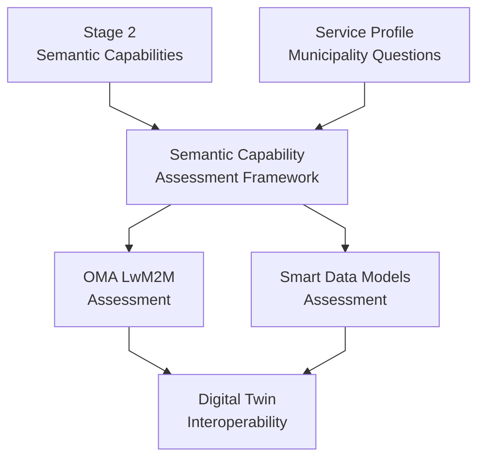

# {{ $doc.title }}

## Introduction

Stage 3 coordinates how the [semantic capabilities](/methodology/core-methodology/stage-2-semantic-capabilities.md) identified in Stage 2 may be realized across standards organizations, Smart Data Models ecosystems, Digital Twin platforms, and interoperability initiatives.

At this stage, operational meaning has already been captured and the semantic capabilities are defined. The objective is not to force a single implementation model or define a centralized architecture, but to:
- assess which ecosystems can supply each capability,
- coordinate ecosystem contributions,
- align interoperability realization approaches,
- and preserve semantic consistency for Digital Twin consumption.

**Input:** the semantic capabilities from [Stage 2](/methodology/core-methodology/stage-2-semantic-capabilities.md) and the municipality operational questions in each Service Profile.
**Output:** ecosystem assessment reports and coordinated realization approaches.

For the SIG's role and the methodology as a whole, see the [Methodology Overview](/methodology/core-methodology/methodology-overview.md).

---

# Purpose of Stage 3

Stage 3 exists to answer the following questions:

- Which ecosystem participants can contribute realization mechanisms?
- Which standards or interoperability assets already exist?
- What semantic gaps remain unresolved?
- How can semantic capabilities be conveyed into Smart Data Models and Digital Twin ecosystems?
- What interoperability validation considerations emerge?
- How can semantic consistency be preserved across ecosystem contributions?

---

# Why Ecosystem Coordination Matters

A single municipality use case may involve IoT devices, operational platforms, semantic integration layers, Digital Twin systems, interoperability standards, and multiple organizational stakeholders. No single standards organization or ecosystem usually owns all these layers, so municipality operational meaning, semantic interoperability concerns, and ecosystem realization approaches have to be analyzed and aligned jointly.

---

# Ecosystem Collaboration Model

Different ecosystem participants contribute different forms of expertise and realization capabilities.

| Participant | Example Contributions |
|---|---|
| Municipalities | Operational realities, pain points, service objectives |
| OMA / LwM2M contributors | Device interoperability standards and objects |
| Smart Data Model ecosystems | Semantic integration structures and practices |
| FIWARE | Digital platform and Digital Twin integration capabilities |
| Universities | Semantic analysis and research support |
| Vendors | Operational implementation realities |
| Other SDOs and alliances | Domain-specific interoperability assets |

---

# Assessing Ecosystems

Each ecosystem is assessed with the [Semantic Capability Assessment Framework](/methodology/assessment-frameworks/semantic-capability-assessment.md) (SCAF), which asks the same questions of every ecosystem for every semantic capability. Each ecosystem's answers are recorded in its own assessment report, listed in the SCAF's [Ecosystem Assessments](/methodology/assessment-frameworks/semantic-capability-assessment.md#ecosystem-assessments) table.

Assessment activities typically include identifying compatible interoperability assets, identifying semantic gaps, evaluating contextual metadata requirements, identifying validation implications, and assessing interoperability consistency.

---

# Mapping to Smart Data Models and Ontologies

After the assessment, each Service Domain is mapped onto the semantic models that will carry it into Digital Twins. The [lighting vs irrigation comparison](/profiles/lighting-vs-irrigation-comparison.md) shows a worked example of both mappings.

## Smart Data Models

Smart Data Models are one of the primary mechanisms through which operational meaning, contextual metadata, provenance information, and semantic consistency are conveyed into Digital Twin ecosystems. They are treated not as isolated technical schemas but as semantically enriched structures that preserve operational intent across ecosystem boundaries.

Pick the closest NGSI entities and properties for the service:
- device and entity types,
- outcome-related attributes (the ones the municipality really cares about),
- and operational and cost attributes (supporting).

Add extensions only when the core model does not cover the key outcome.

Questions to answer:
- Which existing Smart Data Models best fit this service?
- Which properties represent outcome measurements, operational signals, and cost, energy, or resource consumption?

## SAREF and Other Ontologies

Use SAREF's measurement pattern:
- `saref:Device`, `saref:Sensor`, `saref:Actuator`,
- and `saref:Measurement` that `saref:relatesToProperty` some domain property.

Choose domain vocabularies such as SAREF4CITY, SAREF4AGRI, or SAREF4ENVI. Further ontologies are still to be considered.

Questions to answer:
- What are the domain properties (for example, illuminance, soil moisture, fill level, occupancy) this service observes or acts upon?
- How are device roles, measurements (value, unit, time, location), methods, and quality represented consistently across domains?

---

# Validation and Interoperability Considerations

Stage 3 also introduces interoperability validation considerations, such as semantic consistency validation, interoperability verification, contextual completeness validation, measurement comparability, provenance integrity, and operational reliability evaluation.

The objective is to ensure that semantically equivalent information remains interoperable, contextual meaning is preserved, and Digital Twin consumption remains operationally reliable. Validation approaches may evolve through ecosystem collaboration and implementation experience.

---

# Semantic Assembly for Smart City Digital Twins

*Figure — Collaborative Semantic Assembly for Smart City Digital Twins*

In Stage 3, operational pain points identified by municipalities drive a collaborative standards gap analysis across organizations such as the Open Mobile Alliance, the FIWARE Foundation, academia, and other standards ecosystems.

Reusable atomic semantic components — such as OMA Objects and Resources — are evaluated, harmonized, and assembled into contextual Smart Data Models. These combine telemetry, metadata, operational context, and semantic relationships into interoperable structures that can be reused across smart city domains including public lighting, water management, mobility, environment, and energy.

The outcome is a set of contextualized Smart Data Models consumable by Digital Twins.

---

# Common Stage 3 Pitfalls

## Semantic Drift
Ecosystem realization approaches must preserve the operational meaning identified during earlier stages.

## Platform-Centric Thinking
The methodology should remain interoperability-oriented rather than tied to a single platform or ecosystem implementation.

## Ignoring Municipality Intent
Ecosystem realization must remain aligned with the original municipality operational objectives.

Premature architecture lock-in and over-standardization are covered by [Meaning Before Standards](/methodology/core-methodology/methodology-overview.md#meaning-before-standards).

---

# Public Street Lighting Example

The [Public Street Lighting walkthrough](/profiles/lighting/public-lighting-walkthrough.md) (section *Stage 3 — Ecosystem and Interoperability Thinking*) shows this stage in practice, and the [OMA Semantic Capability Assessment](/methodology/assessment-frameworks/oma-capability-assessment.md) records the detailed OMA findings for Public Lighting.
