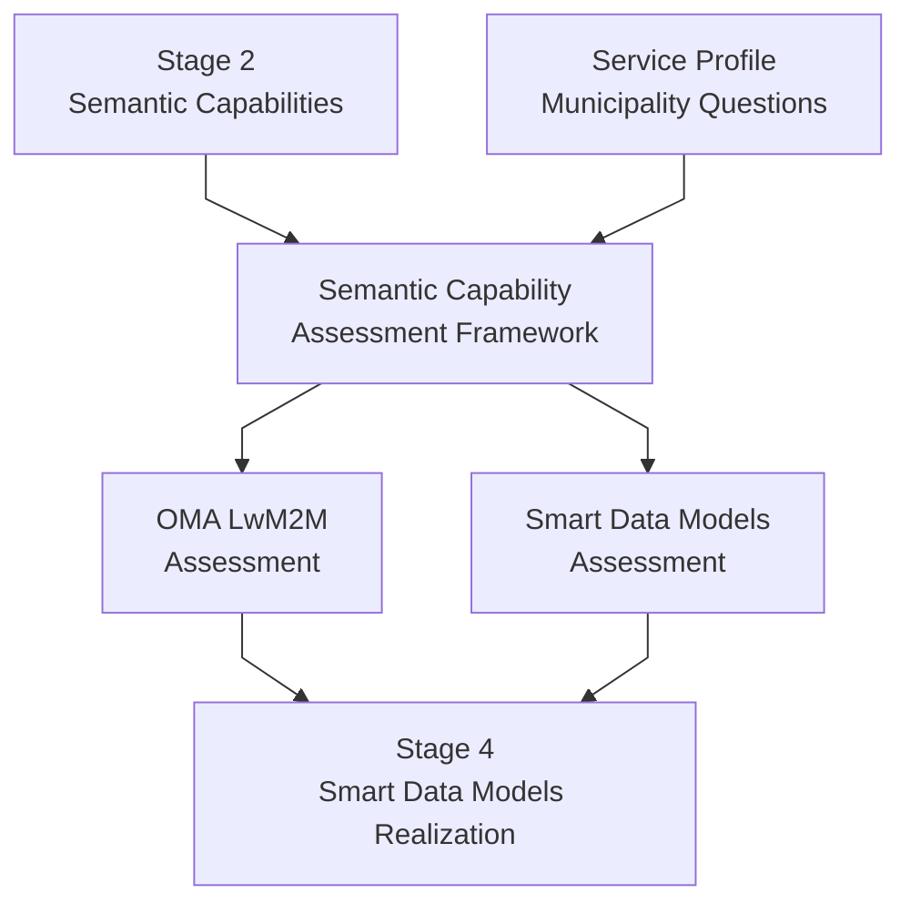

# {{ $doc.title }}

## Introduction

Stage 3 coordinates how the [semantic capabilities](/methodology/core-methodology/stage-2-semantic-capabilities.md) identified in Stage 2 may be realized across standards organizations, Smart Data Models ecosystems, Digital Twin platforms, and interoperability initiatives.

At this stage, operational meaning has already been captured and the semantic capabilities are defined. The objective is not to force a single implementation model or define a centralized architecture, but to:
- assess which ecosystems can supply each capability,
- coordinate ecosystem contributions,
- align interoperability realization approaches,
- and preserve semantic consistency for Digital Twin consumption.

**Input:** the semantic capabilities from [Stage 2](/methodology/core-methodology/stage-2-semantic-capabilities.md), the entity sketch from [Stage 1](/methodology/core-methodology/stage-1-operational-meaning.md#entity-sketch), and the municipality operational questions in each Service Profile.
**Output:** ecosystem assessment reports and coordinated realization approaches — the input to [Stage 4 — Smart Data Models Realization](/methodology/core-methodology/stage-4-smart-data-models-realization.md).

For the SIG's role and the methodology as a whole, see the [Methodology Overview](/methodology/core-methodology/methodology-overview.md).

---

# Purpose of Stage 3

Stage 3 exists to answer the following questions:

- Which ecosystem participants can contribute realization mechanisms?
- Which standards or interoperability assets already exist?
- What semantic gaps remain unresolved?
- How can semantic capabilities be conveyed into Smart Data Models and Digital Twin ecosystems?
- What interoperability validation considerations emerge?
- How can semantic consistency be preserved across ecosystem contributions?

---

# Why Ecosystem Coordination Matters

A single municipality use case may involve IoT devices, operational platforms, semantic integration layers, Digital Twin systems, interoperability standards, and multiple organizational stakeholders. No single standards organization or ecosystem usually owns all these layers, so municipality operational meaning, semantic interoperability concerns, and ecosystem realization approaches have to be analyzed and aligned jointly.

---

# Ecosystem Collaboration Model

Different ecosystem participants contribute different forms of expertise and realization capabilities.

| Participant | Example Contributions |
|---|---|
| Municipalities | Operational realities, pain points, service objectives |
| OMA / LwM2M contributors | Device interoperability standards and objects |
| Smart Data Model ecosystems | Semantic integration structures and practices |
| FIWARE | Digital platform and Digital Twin integration capabilities |
| Universities | Semantic analysis and research support |
| Vendors | Operational implementation realities |
| Other SDOs and alliances | Domain-specific interoperability assets |

---

# Assessing Ecosystems

Each ecosystem is assessed with the [Semantic Capability Assessment Framework](/methodology/assessment-frameworks/semantic-capability-assessment.md) (SCAF), which asks the same questions of every ecosystem for every semantic capability. Each ecosystem's answers are recorded in its own assessment report, listed in the SCAF's [Ecosystem Assessments](/methodology/assessment-frameworks/semantic-capability-assessment.md#ecosystem-assessments) table.

Assessment activities typically include identifying compatible interoperability assets, identifying semantic gaps, evaluating contextual metadata requirements, identifying validation implications, and assessing interoperability consistency.

## Finding Candidate Models and Objects

For each Service Domain, the assessments also look for concrete candidates:
- **Smart Data Models** whose entity types correspond to the entity types in the Stage 1 [entity sketch](/methodology/core-methodology/stage-1-operational-meaning.md#entity-sketch). Properties a model defines but the municipality did not mention go back to Stage 1 as questions for the municipality; properties the municipality needs but no model defines are recorded as gaps.
- **OMA objects** that can supply each observable property under the trustworthiness conditions identified in Stage 2. When no object meets a condition, the condition is re-checked in Stage 2 before it is recorded as a gap.

A candidate is not yet a mapping. Checking that the OMA objects can feed the Smart Data Models, and refining the models where they cannot, is Stage 4.

Bringing the assessment results together, and mapping each Service Domain onto Smart Data Models and ontologies, is the work of [Stage 4](/methodology/core-methodology/stage-4-smart-data-models-realization.md).

---

# Validation and Interoperability Considerations

Stage 3 also introduces interoperability validation considerations, such as semantic consistency validation, interoperability verification, contextual completeness validation, measurement comparability, provenance integrity, and operational reliability evaluation.

The objective is to ensure that semantically equivalent information remains interoperable, contextual meaning is preserved, and Digital Twin consumption remains operationally reliable. Validation approaches may evolve through ecosystem collaboration and implementation experience.

---

# Common Stage 3 Pitfalls

## Semantic Drift
Ecosystem realization approaches must preserve the operational meaning identified during earlier stages.

## Platform-Centric Thinking
The methodology should remain interoperability-oriented rather than tied to a single platform or ecosystem implementation.

## Ignoring Municipality Intent
Ecosystem realization must remain aligned with the original municipality operational objectives.

Premature architecture lock-in and over-standardization are covered by [Meaning Before Standards](/methodology/core-methodology/methodology-overview.md#meaning-before-standards).

---

# Public Street Lighting Example

The [Public Street Lighting walkthrough](/profiles/lighting/public-lighting-walkthrough.md) (section *Stage 3 — Ecosystem and Interoperability Thinking*) shows this stage in practice, and the [OMA Semantic Capability Assessment](/methodology/assessment-frameworks/oma-capability-assessment.md) records the detailed OMA findings for Public Lighting.
