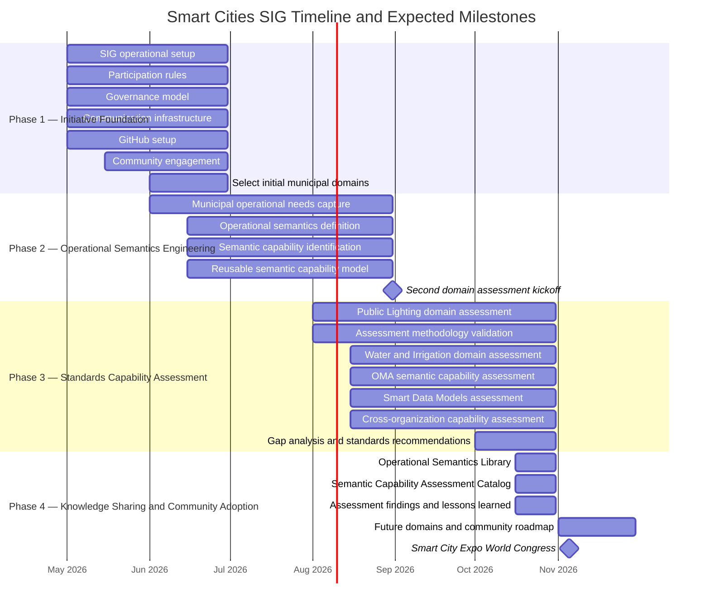

# {{ $doc.title }}

This document defines the high-level execution roadmap, milestones, and expected deliverables for the Smart Cities SIG PoC initiative between May 2026 and November 2026.

The purpose of this plan is to provide participants, contributors, and future stakeholders with a clear understanding of:
- the planned phases of execution,
- major objectives and deliverables,
- expected validation milestones,
- and the timeline leading to the Smart City Expo World Congress 2026 showcase.

The roadmap is intentionally lightweight and iterative, reflecting the Proof of Concept nature of the initiative while maintaining focus on interoperability, reusable outputs, and ecosystem collaboration.

### Phase Summary and Key Milestones

<table>
  <caption><strong>Phase Summary and Key Milestones</strong></caption>
  <thead>
    <tr>
      <th>Phase</th>
      <th>Timeline</th>
      <th>Main Objective</th>
    </tr>
  </thead>
  <tbody>
    <tr>
      <td>Phase 1 — Initiative Foundation</td>
      <td>May–June 2026</td>
      <td>Establish the governance, participation model, collaboration infrastructure, community, and initial municipal domains for the Smart Cities SIG.</td>
    </tr>
    <tr>
      <td>Phase 2 — Operational Semantics Engineering</td>
      <td>June–August 2026</td>
      <td>Capture municipal operational needs, define their operational semantics, and organize them into reusable semantic capabilities.</td>
    </tr>
    <tr>
      <td>Phase 3 — Standards Capability Assessment</td>
      <td>August–October 2026</td>
      <td>Apply and validate the methodology through domain and cross-standard assessments, identify interoperability gaps, and formulate recommendations for standards organizations.</td>
    </tr>
    <tr>
      <td>Phase 4 — Knowledge Sharing and Community Adoption</td>
      <td>October–November 2026</td>
      <td>Publish reusable operational semantics, semantic capability assessments, findings, and recommendations, and present the initiative at Smart City Expo World Congress.</td>
    </tr>
  </tbody>
</table>

