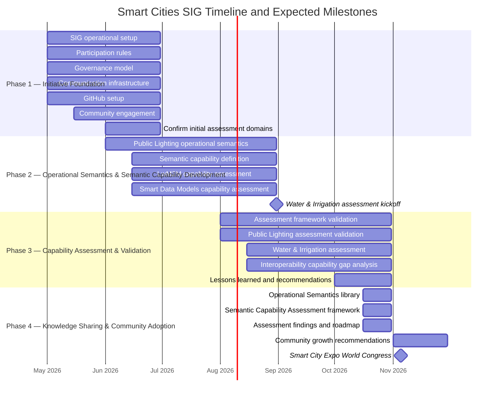

# {{ $doc.title }}

This document defines the high-level execution roadmap, milestones, and expected deliverables for the Smart Cities SIG PoC initiative between May 2026 and November 2026.

The purpose of this plan is to provide participants, contributors, and future stakeholders with a clear understanding of:
- the planned phases of execution,
- major objectives and deliverables,
- expected validation milestones,
- and the timeline leading to the Smart City Expo World Congress 2026 showcase.

The roadmap is intentionally lightweight and iterative, reflecting the Proof of Concept nature of the initiative while maintaining focus on interoperability, reusable outputs, and ecosystem collaboration.

### Phase Summary and Key Milestones

<table>
  <caption><strong>Phase Summary and Key Milestones</strong></caption>
  <thead>
    <tr>
      <th>Phase</th>
      <th>Timeline</th>
      <th>Main Objective</th>
    </tr>
  </thead>
  <tbody>
    <tr>
      <td>Phase 1 — Initiative Foundation</td>
      <td>May–June 2026</td>
      <td>Establish governance, collaboration infrastructure, participation model, and the initial assessment domains.</td>
    </tr>
    <tr>
      <td>Phase 2 — Operational Semantics & Semantic Capability Development</td>
      <td>June–August 2026</td>
      <td>Capture municipal operational semantics, define reusable semantic capabilities, and assess existing standards.</td>
    </tr>
    <tr>
      <td>Phase 3 — Capability Assessment & Validation</td>
      <td>August–October 2026</td>
      <td>Validate the assessment methodology through Public Lighting and Water & Irrigation while identifying interoperability gaps and lessons learned.</td>
    </tr>
    <tr>
      <td>Phase 4 — Knowledge Sharing & Community Adoption</td>
      <td>October–November 2026</td>
      <td>Publish the methodology, present assessment results, and promote community adoption at Smart City Expo World Congress.</td>
    </tr>
  </tbody>
</table>
